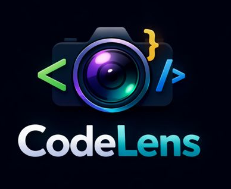

# 🚀 CodeLens — Typing IDE for HTML, CSS & JavaScript

**CodeLens** is a web-based **Typing IDE & Live Preview tool** designed for creating
beautiful **coding videos, tutorials and shorts**.

It types your HTML, CSS and JavaScript code **line by line**, while showing
a **smooth live preview**, optional **camera bubble**, and **assets support** —
just like a real developer workflow.

---

## ✨ Features

- 🧠 Three-file IDE (HTML, CSS, JS)
- ⌨️ Typing animation
- 🎨 Syntax highlighting
- 🖥 Live preview
- 📦 Assets support
- 🎥 Camera bubble

---

## 🖼 Screenshots

---

## 📦 Installation

Clone the repo and open index.html in your browser.

---

MIT License
