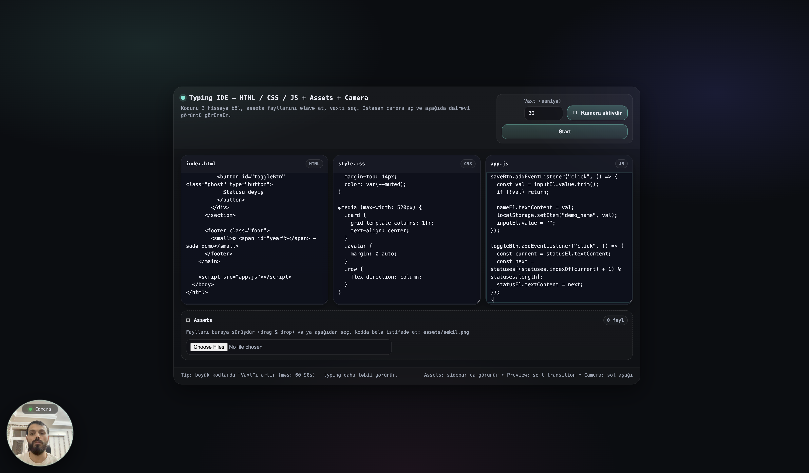
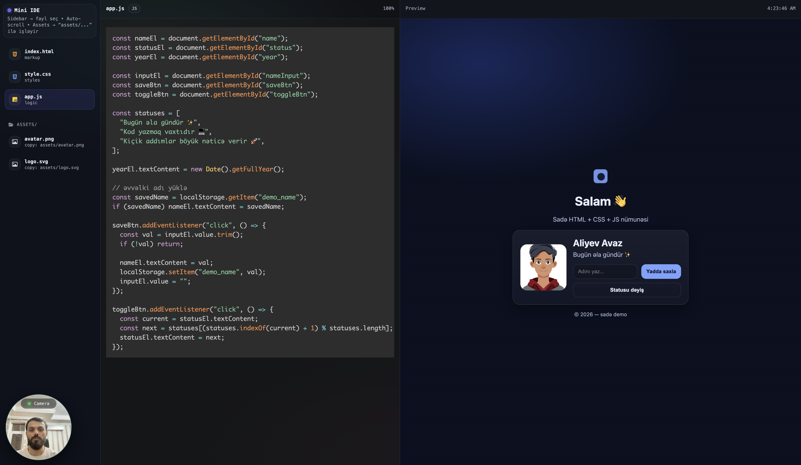

# 🚀 CodeLens — HTML, CSS və JavaScript üçün Typing IDE

**CodeLens** — HTML, CSS və JavaScript kodlarını **sətir-sətir avtomatik yazan** və eyni anda
**canlı preview** göstərən veb əsaslı IDE-dir. Məqsəd:
YouTube Shorts, TikTok, Reels və dərs videoları üçün **peşəkar kod yazma videoları** yaratmaqdır.


---

## 👨‍💻 Müəllif

- **Ad:** Aliyev Avaz  
- **LinkedIn:** https://www.linkedin.com/in/avazalijamal/  
- **YouTube:** https://www.youtube.com/@HEWartTV  

---

## 🌟 Əsas xüsusiyyətlər

- 🧠 **3 fayllı IDE**
  - `index.html`
  - `style.css`
  - `app.js`

- ⌨️ **Avtomatik typing sistemi**
  - Sürət istifadəçi tərəfindən təyin olunur
  - Real IDE kimi yazılır
  - Fayllar avtomatik dəyişir

- 🎨 **Syntax Highlighting**
  - Prism.js ilə rəngli kod
  - Yazıldıqca real vaxtda boyanır

- 🖥 **Live Preview**
  - Ağ ekran flash-ları yoxdur
  - Yumşaq iframe keçidi
  - JS heç vaxt text kimi görünmür

- 📦 **Assets sistemi**
  - Şəkil, audio, font və s yüklə
  - Koda belə yaz:
    ```html
    
    ```

- 📁 **Assets Sidebar**
  - Fayllar ikonlarla görünür
  - Kliklə yol kopyalanır

- 🎥 **Camera bubble**
  - İstəyə görə kamera açılır
  - Sol aşağıda dairəvi görüntü
  - Tutorial və Shorts üçün ideal

---

## 🖼 Ekran görüntüləri




---

## 🛠 İstifadə olunan texnologiyalar

| Texnologiya | Nə üçün istifadə olunur |
|------------|-------------------------|
| **HTML** | UI strukturu, IDE və setup ekranı |
| **CSS** | Modern dizayn, glassmorphism, animasiyalar |
| **JavaScript** | Typing engine, preview, assets, camera, iframe idarəsi |
| **Prism.js** | Kodun rənglənməsi (syntax highlighting) |
| **Font Awesome** | Fayl ikonları (HTML, CSS, JS, image, audio və s) |
| **WebRTC** | Kamera görüntüsünün alınması |
| **iframe + srcdoc** | Təhlükəsiz live preview mühiti |
| **Base64 encoding** | HTML-in parser bug-larını aradan qaldırmaq üçün |

---

## 📦 Layihəni klonlama və işə salma

### 1️⃣ GitHub reposunu klonla

Terminal və ya CMD aç:

```bash
git clone https://github.com/avazalijamal/CodeLens.git
```

### 2️⃣ Qovluğa daxil ol

```bash
cd CodeLens
```

### 3️⃣ Proqramı aç

Sadəcə `index.html` faylını brauzerdə aç:

- Windows: iki dəfə kliklə
- Mac:
```bash
open index.html
```
- Linux:
```bash
xdg-open index.html
```

Heç bir server, build və ya npm lazım deyil.  
Tamamilə client-side işləyir.

---

## 🧪 Necə istifadə olunur

1. HTML, CSS və JS kodunu müvafiq sahələrə yapışdır
2. Assets yüklə (istəsən)
3. Vaxtı seç (məsələn 30 saniyə)
4. (İstəsən) Kameranı aktiv et
5. **Start** düyməsinə bas

Kod avtomatik yazılacaq və sağ tərəfdə canlı nəticəni görəcəksən.

---

## 🎯 Nə üçün istifadə olunur?

- YouTube Shorts
- TikTok coding videos
- Instagram Reels
- Kurs dərsləri
- Demo videolar
- Portfolio videolar

---

## 📄 Lisenziya

MIT License — tam açıq və sərbəstdir.

---

## ❤️ Yaradıcı

Bu layihə **Aliyev Avaz** tərəfindən hazırlanmışdır.  
YouTube kanalında daha çox proqramlaşdırma və kreativ kontent:

👉 https://www.youtube.com/@HEWartTV